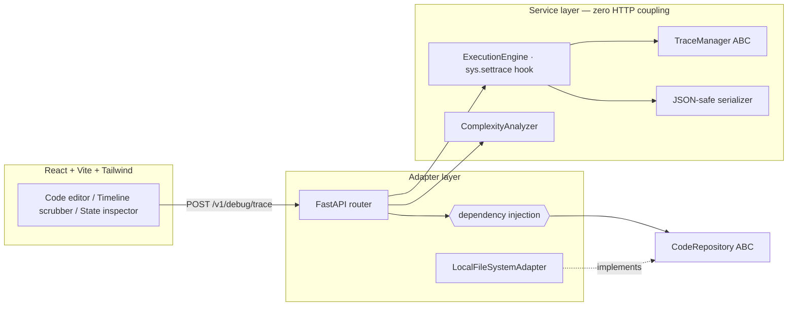

# DSA Visual Debugger

A web-based visual execution debugger for practicing Python Data Structures &
Algorithms. Paste a function, run it once, then **scrub forward and backward
through every line of its execution** — watching variables mutate, call frames
open and close, and data structures (arrays, matrices, hash maps, linked
lists) render as visual blocks instead of text.

Beyond stepping, it can **empirically measure a function's Big-O**: it runs
your code at increasing input sizes, counts traced operations, and fits the
measurements against candidate growth curves. Planning tools (a pseudocode
notepad and a drag-and-drop flowchart canvas) support thinking before coding.

> **Live demo:** the deployed frontend ships with pre-recorded traces
> (bubble sort, two sum, linked-list reversal) — clone the repo to trace
> your own code with the live backend.

## How it works

The backend executes the submitted function once under a `sys.settrace` hook,
recording a complete timeline: line number, active frame, and a JSON-safe
deep snapshot of local variables at every step. The frontend loads that
timeline and makes "time travel" a pure array index — stepping is instant,
offline, and bidirectional.



## Architecture highlights

This project is deliberately structured as a **clean DDD exercise** — the
decisions and their trade-offs are documented as ADRs in
[`ARCHITECTURAL_DECISION.md`](ARCHITECTURAL_DECISION.md):

- **ADR-001** — `sys.settrace` over `bdb`: one-pass timeline recording with
  explicit safety engineering (step ceiling, frame-depth cap, wall clock, and
  an abort signal derived from `BaseException` so user code's
  `except Exception` cannot swallow it).
- **ADR-002** — two-stage serialization: snapshot at trace time, then a
  never-raises recursive sanitizer with cycle detection (`id()` path set),
  depth/size caps, and tagged custom objects so a linked-list `Node` renders
  as a visual card, not a repr string.
- **ADR-003** — the frontend state model is one immutable array plus one
  integer; every panel is a pure projection of `timeline[currentStep]`.
- **ADR-004** — full-payload load, no streaming: bounded by construction.
- **ADR-005** — empirical Big-O: step counts across input sizes,
  least-squares fit against O(1) … O(2ⁿ), simpler class wins near-ties.
- **ADR-006** — planning tools; React Flow chosen for interactive flowcharts.

**Repository pattern in practice:** all persistence sits behind a
`CodeRepository` ABC injected into the router via FastAPI `Depends`. Swapping
local-disk storage for S3 or MongoDB is one provider-function change — zero
edits to business logic or endpoints. The service layer imports nothing from
FastAPI and is tested without HTTP (29 pytest tests).

## Running locally

**Backend** (Python 3.11+):

```bash
cd backend
python -m venv venv && source venv/bin/activate
pip install -r requirements.txt
uvicorn main:app --reload          # http://localhost:8000
```

**Frontend** (Node 18+):

```bash
cd frontend
npm install
npm run dev                        # http://localhost:5173 (proxies /v1)
```

**Tests:**

```bash
cd backend && python -m pytest tests -q
```

## API

| Endpoint | Purpose |
|---|---|
| `POST /v1/debug/trace` | Execute a function, return the full step timeline |
| `POST /v1/debug/complexity` | Measure steps across input sizes, fit Big-O |
| `POST /v1/code/save` | Persist a snippet via the injected repository |
| `GET /v1/code/{id}` | Retrieve a saved snippet |

## Security posture

The tracer's limits are guardrails for a **local learning tool**, not an OS
sandbox — submitted code runs with interpreter privileges. The documented
hardening path for multi-tenant deployment is per-run subprocess isolation;
the public demo therefore ships as a static frontend with pre-recorded
traces instead of a live code-execution service.
